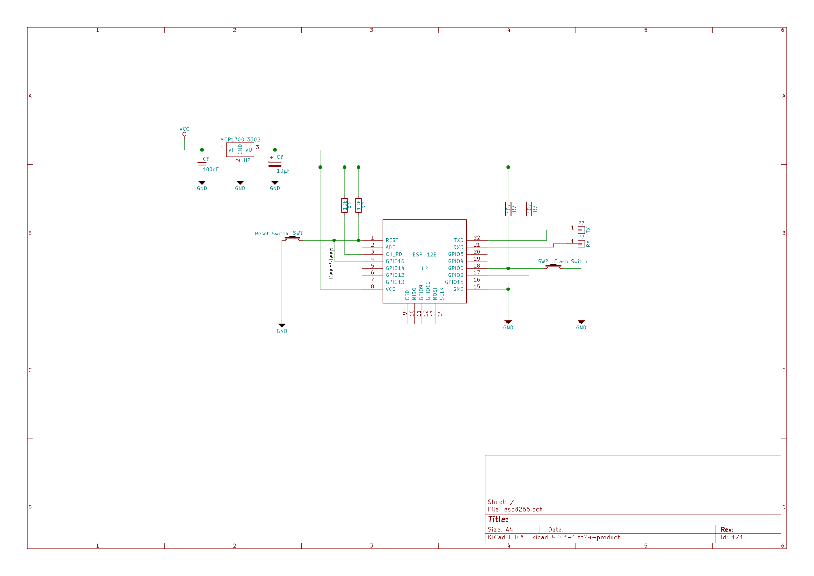
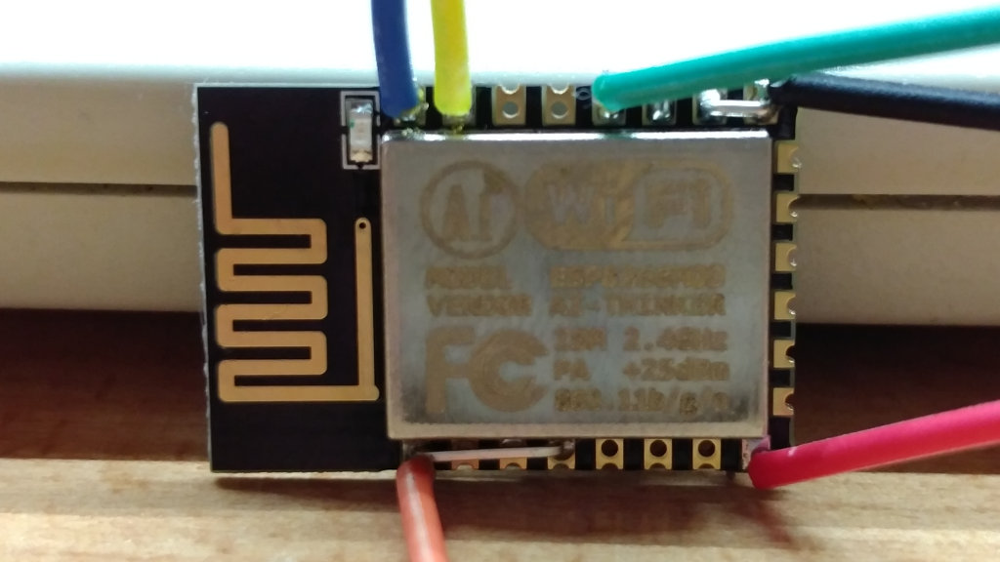
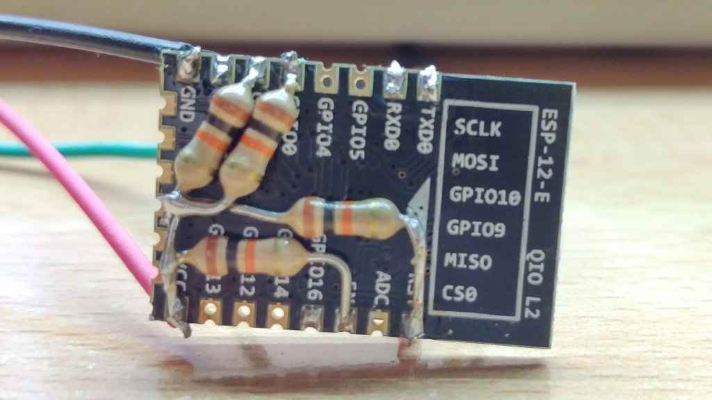

## Description
Minimum circuit to run an ESP8266 (12E) in a stable environment. Supports reset, flash and deep sleep. As power regulator a [MCP 1700-3302](http://ww1.microchip.com/downloads/en/DeviceDoc/20001826C.pdf) is used.

## Schemata
Schemata is created with KiCAD. Additional library for [ESP8266](https://github.com/jdunmire/kicad-ESP8266) is needed.

## Result

